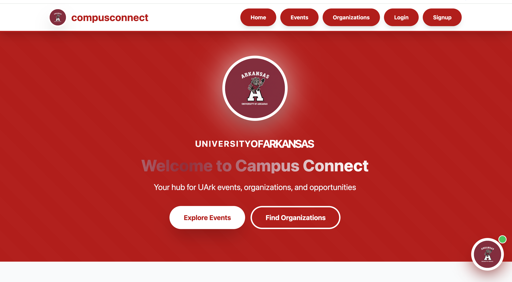
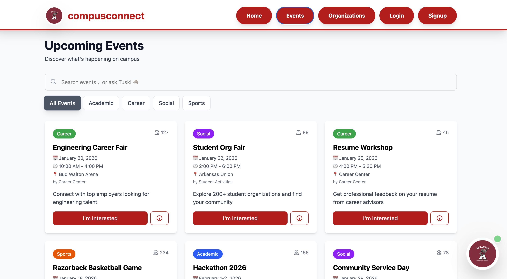
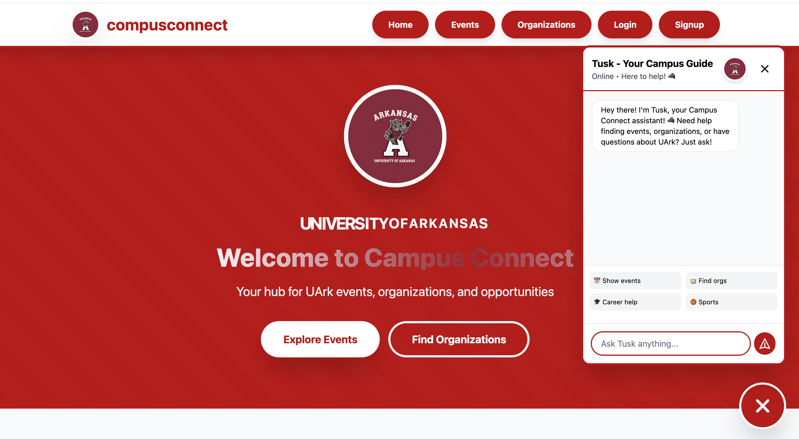
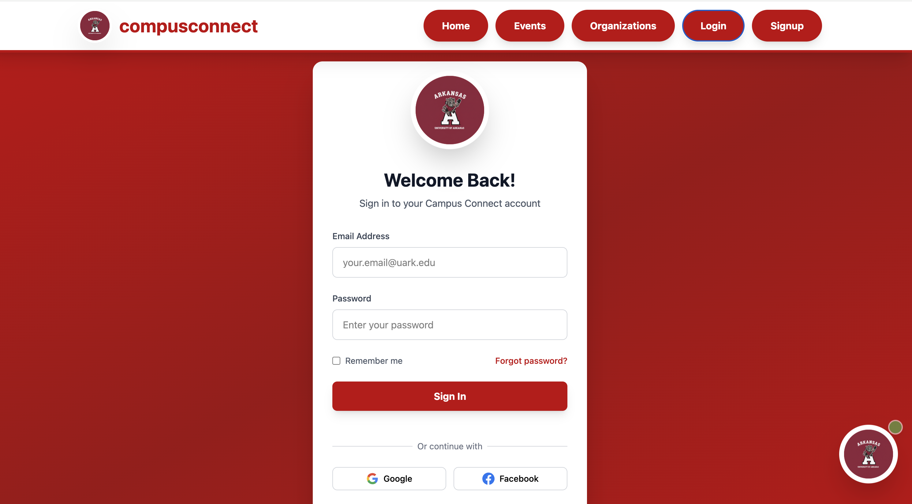
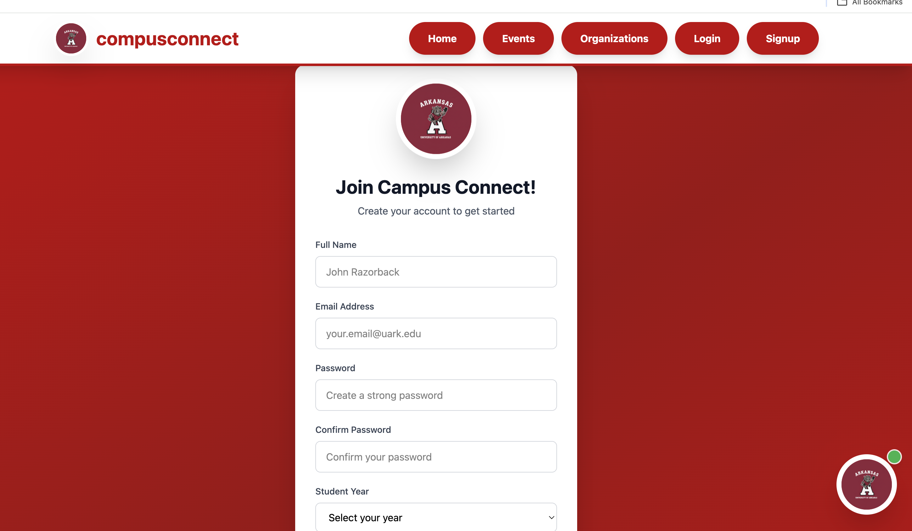

# Campus Connect - Frontend (React + Vite)

## 🚀 Live Demo
**[View Live Demo on Vercel](https://vercel.com/wahid123542s-projects/campus-connect/BQhGrbqL6VP1cg2WXPy5d7ZUSgQW)**

## 📸 Screenshots

### Home Page


### Events Page


### Organizations Page


### Tusk AI Chatbot


### Login Page


### Signup Page


---

## Overview
React-based frontend for Campus Connect, a web platform for University of Arkansas students featuring event discovery, student organizations, and an AI chatbot assistant (Tusk the Razorback).

## What It Does
Campus Connect frontend provides an intuitive web interface for University of Arkansas students to:
- **Browse Campus Events**: View upcoming events with detailed information including date, time, location, and categories
- **Explore Student Organizations**: Discover various student organizations across different categories with member information
- **Interactive AI Chatbot**: Engage with Tusk, an Arkansas Razorbacks-themed AI assistant for student support
- **User Authentication**: Register and login with comprehensive forms including interest selection
- **Personalized Experience**: Select interests during signup to customize the campus experience
- **Responsive Design**: Access the platform seamlessly across desktop, tablet, and mobile devices

## Tech Stack
- **Framework**: React 18
- **Build Tool**: Vite
- **Styling**: Tailwind CSS
- **UI Components**: Custom components with Arkansas Razorbacks branding
- **State Management**: React Hooks (useState, useEffect)

## Project Structure
```
campus-connect/
├── src/                   # Frontend source files
│   ├── components/        # Reusable UI components
│   │   ├── Navbar.jsx
│   │   ├── Chatbot.jsx
│   │   ├── EventCard.jsx
│   │   └── ...
│   ├── pages/            # Page components
│   │   ├── Home.jsx
│   │   ├── Events.jsx
│   │   ├── Organizations.jsx
│   │   ├── Login.jsx
│   │   └── Signup.jsx
│   ├── App.jsx           # Main app component
│   ├── main.jsx          # Entry point
│   └── index.css         # Tailwind imports
├── public/               # Static assets
├── backend/              # Django backend folder (separate)
├── index.html
├── vite.config.js
├── tailwind.config.js
└── package.json
```

## Branding
**University of Arkansas Razorbacks Theme**
- Primary Color: Cardinal Red `#9D2235`
- Mascot: Tusk (AI Chatbot)
- Clean, modern design with school spirit

## Setup & Installation

### Prerequisites
- Node.js 16+
- npm or yarn

### Installation
```bash
# Install dependencies
npm install

# Run development server
npm run dev

# Build for production
npm run build
```

Access the app at `http://localhost:5173`

## Features

### UI Components
- **Navbar**: Responsive navigation with Arkansas Razorbacks branding
- **Chatbot (Tusk)**: Interactive circular chatbot with pulsing animations and rainbow letter effects
- **Event Cards**: Beautiful card design with event details and interactive modal popups
- **Organization Cards**: Professional card layout displaying organization information
- **Login Page**: Complete login form with Arkansas branding and validation
- **Signup Page**: Comprehensive signup form with interest selection interface

### Visual Design
- Tailwind CSS styling throughout
- Cardinal red color scheme (#9D2235) matching University of Arkansas branding
- Modern animations and smooth transitions
- Polished, interactive user interface
- Responsive design for all screen sizes

### User Experience
- Intuitive navigation
- Clean, modern interface
- Interactive elements with visual feedback
- Professional Arkansas Razorbacks theming
- Smooth animations and transitions

## Technologies Used
- React 18 with Vite
- Tailwind CSS for styling
- Custom animations and transitions
- Component-based architecture

## Contributors
**Wahid Sultani** - Full Stack Developer  
GitHub: [@Wahid123542](https://github.com/Wahid123542)
